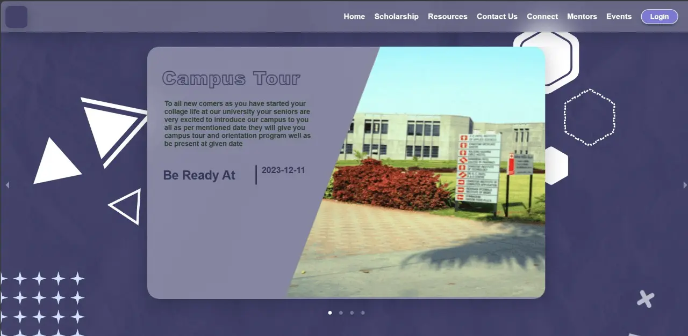
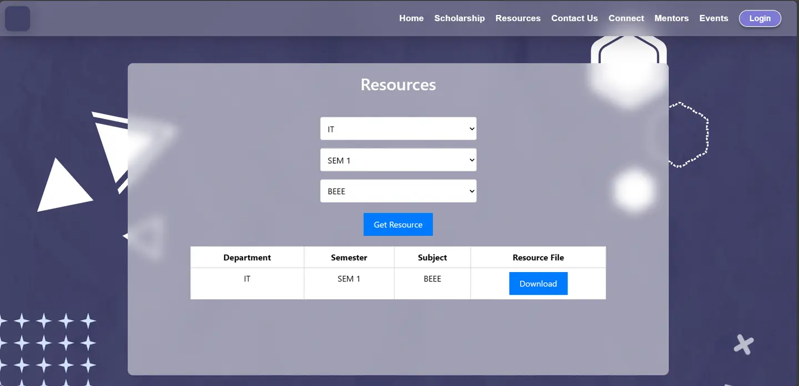
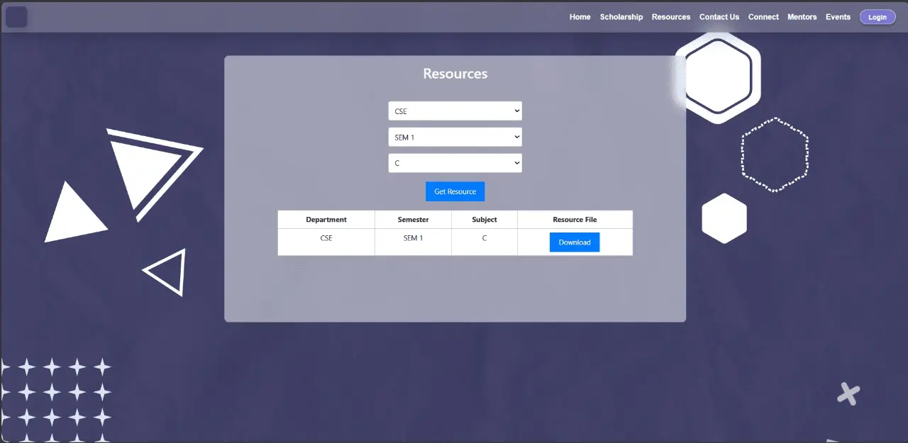
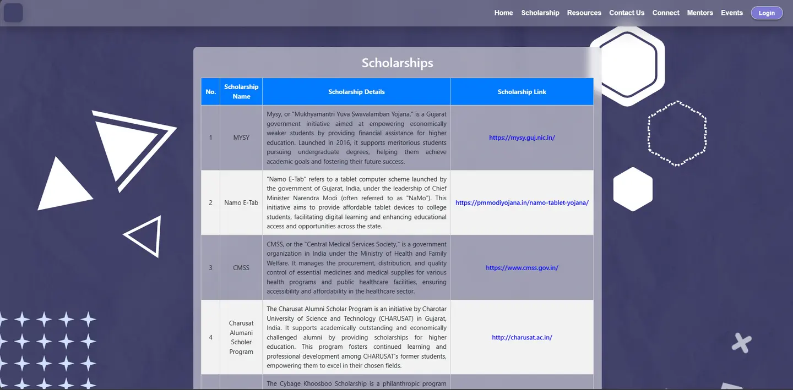

## Welcome
Hi 👋, We're Team **ProSolvers** ,our team of few Tech enthusiast students
- We done this project as part of hackathon organized by **DAIICT** named as **Tic-Tech-Toe.**

## Check Us out
check our project at  
Devfolio.co | https://devfolio.co/projects/freshstart-guide-1e4d  
also don't forget to like our project
## Acknowledgements
 - We would like to extend our heartfelt thanks to this hackathon **Tic-Tech-Toe** and **DAIICT** to held such hackathon ,Their inputs have helped us to improve the project and make it more relevant to the needs of the freshers.
 - We as **Team ProSolver** are expressing our big thank you to all team who manages such event. We learned a lot with such event
## Title : FreshStart Guide
**Description:** FreshStart Guide is a comprehensive web application tailored for new college students,
offering essential information for a smooth transition into their initial semester. The platform will be managed by experienced college seniors to provide insights, guidance, and resources.  
This Web application is consists pages like these:
- Home page : it a landing page for freshstart guide. Here announcment regarding any event can be done through dashboard.It also have memories and contact us section in it.
- Connect : When any fresher join the collage he/she have problme in making friends not just that he feel hard to find people from same places so here one can join whatsapp group of cities.
- Scholarship : Student can get all scholarship info where he can apply.
- Mentor : Student at starting phase wants to learn some new tech but he didn't knew much he need mentor to whom he can ask and can get carrer advices.This mentor can be senior student or faculties.
- Resources: Student at startning level can't find e-books and ppts for study, Here seniors will help them by sharing old question papers and e-books also refrence material

## Installation

After downloading git repository open command prompt and change active directory to repository folder using cd command.
than run follwing command
- Step 1:
```bash
  >>> cd FrontEnd
  >>> npm i
  >>> npm start
```
Now react side web app will be running at **localhost:3000**  

- Step 2:
For running backend open new terminal at repository main  directory than run these commands 

Step 2:
    
```bash
>>> cd BackEnd
>>> yarn develop

```
This will make your backend run at **localhost:1337/**   
>‼️‼️‼️‼️‼️‼️‼️‼️‼️‼️‼️‼️‼️‼️‼️‼️‼️‼️‼️‼️‼️‼️‼️‼️‼️‼️‼️‼️‼️‼️‼️‼️‼️‼️‼️‼️‼️‼️‼️‼️‼️‼️‼️‼️‼️‼️‼️‼️‼️‼️‼️‼️‼️‼️‼️‼️‼️‼️‼️‼️‼️‼️‼️
> **Important:**
> Through whole project wherever you see **10.200.55.189:1337** replace it with **localhost:1337**
>‼️‼️‼️‼️‼️‼️‼️‼️‼️‼️‼️‼️‼️‼️‼️‼️‼️‼️‼️‼️‼️‼️‼️‼️‼️‼️‼️‼️‼️‼️‼️‼️‼️‼️‼️‼️‼️‼️‼️‼️‼️‼️‼️‼️‼️‼️‼️‼️‼️‼️‼️‼️‼️‼️‼️‼️‼️‼️‼️‼️‼️‼️‼️

## Screenshots📱








## Authors👨‍💻

- Vishu Bhingradiya[@Vishu_github](https://github.com/Vishuvishu) | [@Vishu_LinkedIn](https://www.linkedin.com/in/vishu-kishorbhai-667668229) 
- Utsav Kathrotiya [@Utsav_github](https://github.com/Utsav-7/) | [@Utsav_Linkedin](https://www.linkedin.com/in/utsav-katharotiya/) 
- Ronil Lakhani [@Ronil_github](https://github.com/Ronil999) | [@Ronil_Linkedin](https://www.linkedin.com/in/ronil-lakhani/) 
- Ujas Bhatt [@Ujas_github](https://github.com/UjasBhatt10) | [@Ujas_linkedin](https://www.linkedin.com/in/ujas-bhatt-b56922228/) 
- Sujal Mansuri [@Sujal_github](https://github.com/Sujal1104) | [@Sujal_Linkedin](https://www.linkedin.com/in/sujal-mansuri-b9aa55228/) 


## Color Reference

| Color             | Hex                                                                |
| ----------------- | ------------------------------------------------------------------ |
| ThemeColor |  #434269 |
| ButtonColor |  #2980b9 |
| Footer |  #365b6d |
| Footer2 |  #8aa6d6 |


## Run Locally

Clone the project

```bash
  git clone https://link-to-project
```

Go to the project directory

```bash
  cd my-project
```

Install dependencies

```bash
  npm install
```

Start the server

```bash
  npm run start
```

